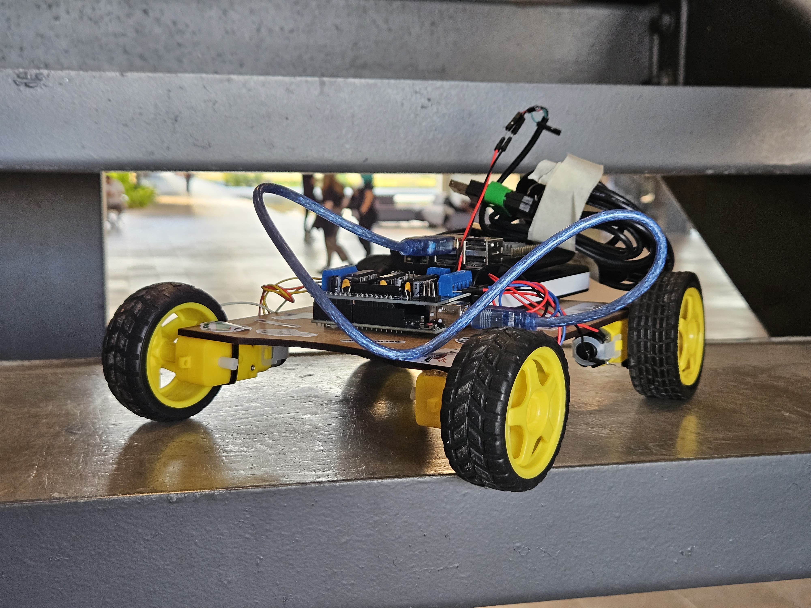
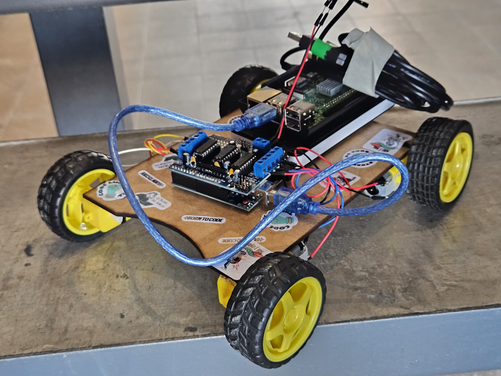
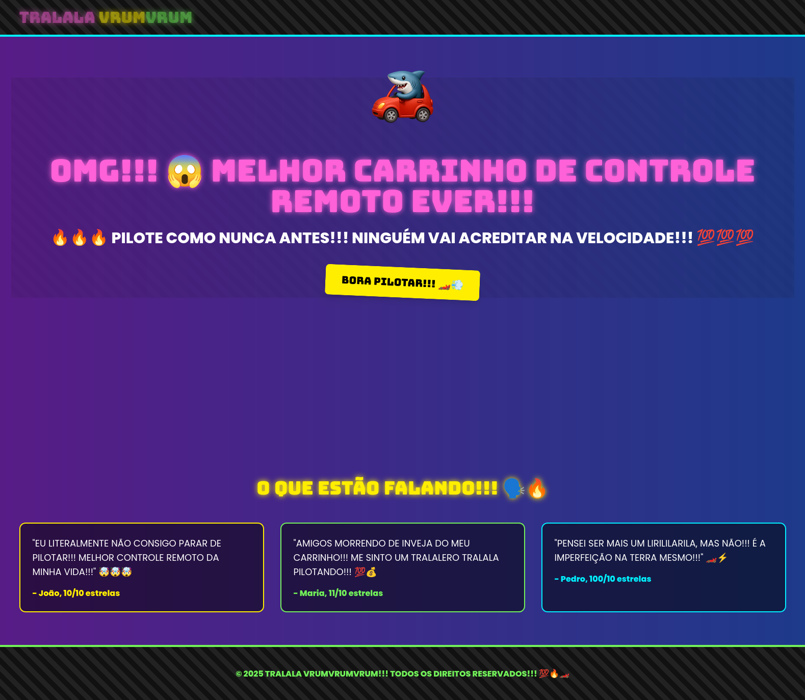
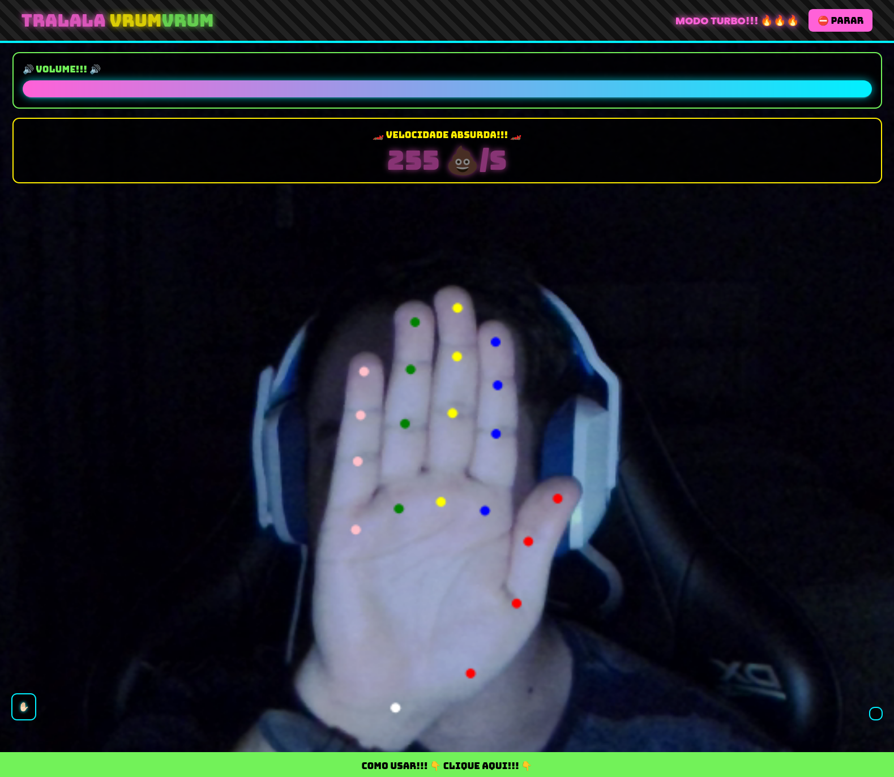
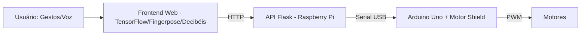

# Tralala VrumVrumVrum 🚗💨

[![Arduino][arduino-badge]][arduino-url]
[![Flask][flask-badge]][flask-url]
[![TensorFlow][tf-badge]][tf-url]
[![Raspberry Pi][rpi-badge]][rpi-url]
[![Docker][docker-badge]][docker-url]
[![Nginx][nginx-badge]][nginx-url]

<p align="center">
  
</p>

## 🔥 PILOTE COMO NUNCA ANTES!!! NINGUÉM VAI ACREDITAR NA VELOCIDADE!!! 💯

O Tralala VrumVrumVrum é um projeto open source que transforma gestos e voz em comandos para um carrinho robô real, usando tecnologias modernas de IA, web e eletrônica. Controle o robô com as mãos ou gritos e surpreenda todo mundo com a velocidade!

---

## 🤖 Fotos do Robô

<p align="center">
  
  <br>
  <b>Visão frontal do robô montado, mostrando o chassi, motores, rodas, Arduino e Raspberry Pi.</b>
</p>
<p align="center">
  
  <br>
  <b>Visão superior destacando a montagem eletrônica: Arduino Uno, Motor Shield L293D, Raspberry Pi e cabeamento.</b>
</p>

---

## 🖥️ Imagens da Interface Web

<p align="center">
  
  <br>
  <b>Página inicial do site, com visual moderno, colorido e chamativo.</b>
</p>
<p align="center">
  
  <br>
  <b>Página de controle: mostra o reconhecimento de gestos, velocímetro e feedback visual em tempo real.</b>
</p>

<p align="center">
  
  <br>
  <b>Ícone oficial do Tralala VrumVrumVrum.</b>
</p>

---

## 🧩 Componentes do Projeto

- **Arduino Uno + Motor Shield L293D**: Controle dos 4 motores DC
- **Raspberry Pi**: Roda o backend Flask e serve o frontend
- **Frontend Web**: Interface moderna com reconhecimento de gestos (TensorFlow.js) e volume de voz
- **Powerbank 10000mAh**: Alimentação do robô
- **Chassi, rodas, motores**: Montagem física

---

## 🚦 Como Funciona



1. O usuário faz gestos ou grita na interface web
2. O frontend envia comandos HTTP para a API Flask
3. O backend converte e envia comandos via USB para o Arduino
4. O Arduino aciona os motores conforme o comando recebido

---

## 🕹️ Experimente!

1. **Monte o robô** seguindo o diagrama e fotos acima
2. **Suba o código no Arduino** (`vehicle/Vehicle.ino`)
3. **Rode o backend Flask** no Raspberry Pi
4. **Acesse a interface web** pelo navegador
5. **Permita acesso à câmera e microfone**
6. **Faça gestos ou grite para acelerar!**

---

## 📦 Estrutura do Projeto

```
├── backend/      # API Flask e comunicação serial
├── frontend/     # Interface web (HTML, JS, CSS, ícones)
├── proxy/        # Proxy reverso Nginx
├── vehicle/      # Código Arduino e instruções de montagem
├── images/       # Fotos do robô e screenshots
├── docker-compose.yml
└── README.md     # Este arquivo
```

---

## 🛠️ Tecnologias
- **Python, Flask, pyserial**
- **TensorFlow.js, MediaPipe, Fingerpose**
- **Nginx, Docker**
- **Arduino C++**

---

## 📚 Documentação
- [Frontend](frontend/README.md)
- [Backend/API](backend/README.md)
- [Exemplos de API](backend/API-EXAMPLES.md)
- [Proxy](proxy/README.md)
- [Montagem do Robô](vehicle/README.md)

---

## 🚀 Como executar o projeto

1. **Clone o repositório:**
   ```sh
   git clone https://github.com/seu-usuario/tralala-vrumvrumvrum.git
   cd tralala-vrumvrumvrum
   ```
2. **Monte o robô físico** conforme instruções e diagramas em [Montagem do Robô](vehicle/README.md).
3. **Conecte o Arduino ao Raspberry Pi** via USB e faça o upload do código (`vehicle/Vehicle.ino`).
4. **Configure e execute tudo com Docker Compose:**
   ```sh
   docker compose up --build
   ```
   Isso irá subir o backend Flask, o frontend e o proxy Nginx automaticamente.
5. **Acesse a interface web:**
   - No navegador, acesse: [http://localhost](http://localhost) (ou o IP do seu Raspberry Pi)
6. **Permita o acesso à câmera e microfone** quando solicitado.
7. **Pronto!** Faça gestos ou grite para controlar o robô!

---

## 📝 Licença
Distribuído sob [GNU GPL v3.0](./LICENSE).

[arduino-badge]: https://img.shields.io/badge/Arduino-00979C?style=for-the-badge&logo=Arduino&logoColor=white
[arduino-url]: https://www.arduino.cc/
[flask-badge]: https://img.shields.io/badge/Flask-000000?style=for-the-badge&logo=flask&logoColor=white
[flask-url]: https://flask.palletsprojects.com/
[tf-badge]: https://img.shields.io/badge/TensorFlow-FF6F00?style=for-the-badge&logo=tensorflow&logoColor=white
[tf-url]: https://www.tensorflow.org/
[rpi-badge]: https://img.shields.io/badge/Raspberry%20Pi-C51A4A?style=for-the-badge&logo=Raspberry-Pi&logoColor=white
[rpi-url]: https://www.raspberrypi.com/
[docker-badge]: https://img.shields.io/badge/docker-2496ED?style=for-the-badge&logo=docker&logoColor=white
[docker-url]: https://www.docker.com/
[nginx-badge]: https://img.shields.io/badge/nginx-009639?style=for-the-badge&logo=nginx&logoColor=white
[nginx-url]: https://www.nginx.com/
