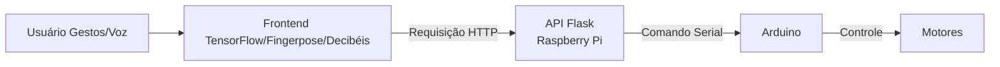

# Tralala VrumVrumVrum
[![Arduino][arduino-badge]][arduino-url]
[![Flask][flask-badge]][flask-url]
[![TensorFlow][tf-badge]][tf-url]
[![Raspberry Pi][rpi-badge]][rpi-url]
[![Docker][docker-badge]][docker-url]
[![Nginx][nginx-badge]][nginx-url]

## 🔥🔥🔥 PILOTE COMO NUNCA ANTES!!! NINGUÉM VAI ACREDITAR NA VELOCIDADE!!! 💯💯💯

Com o Tralala VrumVrumVrum, você pode controlar um carrinho de controle remoto com gestos e a sua voz!
Este projeto integra um sistema de controle de motores via Arduino, uma API em Flask e uma interface web para interação com gestos e voz.

## Componentes Principais
- **Arduino**: Responsável pelo controle dos motores.
- **Flask**: Disponibiliza rotas para receber instruções de movimentação.
- **Frontend**: Usa TensorFlow e Fingerpose para reconhecer gestos e envia comandos via requisições HTTP. Também há um medidor de decibéis que controla a velocidade.

## Estrutura de Pastas
- `arduino/`: Contém o código para o microcontrolador controlar os movimentos e receber comandos através do protocolo USB Serial.
- `serial-api/`: Contém a aplicação Flask responsável por comunicar com o Arduíno através do protocolo USB Serial.
- `public/`: Arquivos estáticos (HTML, CSS, JavaScript) para interação através de voz e gestos do usuário.

## Uso
1. Suba a aplicação Flask (app.py) no Raspberry Pi para receber e responder às requisições.
2. Sirva os arquivos HTML da pasta `public/` também no Raspberry Pi (por exemplo, via docker-compose com Nginx).
3. Conecte seu Arduino ao computador e suba o sketch para controlar os motores.  
4. Acesse a interface web e teste a calibração do microfone e dos gestos.

## Gestos Reconhecidos

A interface web reconhece diferentes gestos com as mãos para controlar o carrinho. Veja abaixo os gestos disponíveis:

- 👆🏻 **Para cima:** 
- 🖕🏻 **Dedo do meio:** 
- 🖐️ **Mão Aberta:**
- 👍🏻 **Joinha:**
- 👎🏻 **Dislaique:**
- ✌️ **Dois Dedos (V):** 
- 🔫 **Arminha:** 

> Os gestos podem ser personalizados no arquivo `public/js/gestures.js`.

## Requisitos
- Arduino com biblioteca AFMotor instalada.
- Python 3 e Flask instalados para a API.
- TensorFlow e Fingerpose (incluso via CDN no HTML).
- Para permitir o uso de câmera ou microfone em conexões não seguras, ative a flag
[chrome://flags/#unsafely-treat-insecure-origin-as-secure](chrome://flags/#unsafely-treat-insecure-origin-as-secure)
e inclua o endereço do Raspberry Pi (por exemplo: http://raspberrypi.local) como origem confiável.

## Fluxo de funcionamento

## Licença
O projeto é distribuído sob a [GNU General Public License v3.0](./LICENSE).

[arduino-badge]: https://img.shields.io/badge/Arduino-00979C?style=for-the-badge&logo=Arduino&logoColor=white
[arduino-url]: https://www.arduino.cc/
[flask-badge]: https://img.shields.io/badge/Flask-000000?style=for-the-badge&logo=flask&logoColor=white
[flask-url]: https://flask.palletsprojects.com/
[tf-badge]: https://img.shields.io/badge/TensorFlow-FF6F00?style=for-the-badge&logo=tensorflow&logoColor=white
[tf-url]: https://www.tensorflow.org/
[rpi-badge]: https://img.shields.io/badge/Raspberry%20Pi-C51A4A?style=for-the-badge&logo=Raspberry-Pi&logoColor=white
[rpi-url]: https://www.raspberrypi.com/
[docker-badge]: https://img.shields.io/badge/docker-2496ED?style=for-the-badge&logo=docker&logoColor=white
[docker-url]: https://www.docker.com/
[nginx-badge]: https://img.shields.io/badge/nginx-009639?style=for-the-badge&logo=nginx&logoColor=white
[nginx-url]: https://www.nginx.com/
