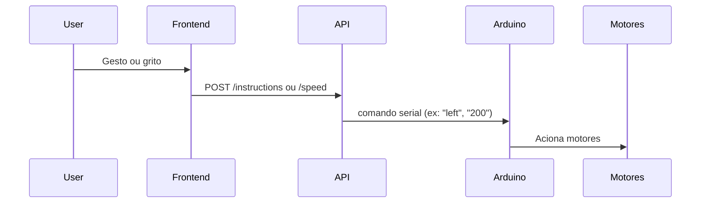

# Serial API

Essa etapa, é responsável por criar uma API que irá se comunicar com o Arduino via Serial. Para isso, utilizamos a biblioteca `pyserial` para facilitar a comunicação serial entre o Python e o Arduino.

## Como executar

Instale as dependências do Python e execute o comando:

```
python run main.py
```

# Backend API - Tralala VrumVrumVrum

Esta API é responsável por receber comandos HTTP do frontend e enviá-los via porta serial para o Arduino, que controla o robô.

## Visão Geral

- **Framework:** Flask
- **Comunicação Serial:** pyserial
- **Função:** Traduz comandos HTTP em comandos seriais compreendidos pelo Arduino

## Diagrama de Fluxo

```mermaid
flowchart TD
    A[Frontend (Web)] -- HTTP POST /instructions ou /speed --> B[API Flask (backend)]
    B -- Comando Serial --> C[Arduino]
    C -- Controle --> D[Motores do Robô]
```

## Como Funciona

1. O frontend envia comandos de direção (`left`, `right`, `forward`, `stop`) ou velocidade (0-255) via requisições HTTP POST.
2. A API Flask recebe esses comandos nas rotas `/instructions` (direção) e `/speed` (velocidade).
3. O backend converte o comando em texto e envia pela porta serial para o Arduino.
4. O Arduino interpreta o comando e aciona os motores conforme a instrução recebida.

## Exemplo de Requisições

### Comando de Direção
```http
POST /instructions
Content-Type: application/json
{
  "command": "left"
}
```

### Comando de Velocidade
```http
POST /speed
Content-Type: application/json
{
  "speed": 200
}
```

## Principais Rotas

- `POST /instructions` — Recebe comandos de direção (`left`, `right`, `forward`, `stop`)
- `POST /speed` — Recebe valor de velocidade (0 a 255)

## Lógica de Envio Serial

```python
# Trecho do backend/main.py

def send_command(command):
    if arduino and arduino.is_open:
        arduino.write((command + '\n').encode('utf-8'))
        return True
    return False
```

- O comando é enviado como texto seguido de uma quebra de linha (\n) para o Arduino.
- O Arduino lê a linha recebida e executa a ação correspondente.

## Diagrama de Sequência



## Como Executar

1. Instale as dependências:
   ```sh
   pip install -r requirements.txt
   ```
2. Conecte o Arduino na porta USB (ajuste o SERIAL_PORT se necessário).
3. Execute a API:
   ```sh
   python main.py
   ```

## Observações
- Certifique-se de que o usuário do sistema tem permissão para acessar a porta serial.
- O Arduino deve estar rodando o sketch correto para interpretar os comandos recebidos.

## Exemplo de Integração

Ao receber um comando de velocidade:
- O backend recebe `{ "speed": 200 }` via HTTP
- Envia `200\n` via serial para o Arduino
- O Arduino ajusta a velocidade dos motores conforme o valor recebido

---

Para mais detalhes, consulte o código em `main.py` e o sketch do Arduino em `vehicle/Vehicle.ino`.