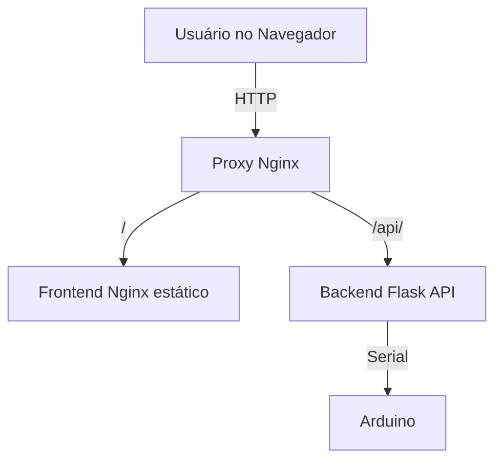

# Proxy (Nginx) - Tralala VrumVrumVrum

A proxy reversa baseada em Nginx é responsável por rotear as requisições HTTP entre o frontend (interface web) e o backend (API Flask), além de fornecer uma camada de segurança, organização e facilitar o acesso ao sistema.

## Motivo da Existência

- **Unificação de acesso:** Permite que tanto a interface web quanto a API backend sejam acessadas pelo mesmo endereço e porta (ex: http://localhost), simplificando o uso para o usuário final.
- **Separação de responsabilidades:** O frontend e o backend podem rodar em containers separados, mas o usuário acessa tudo de forma transparente.
- **CORS e segurança:** Evita problemas de CORS, já que todas as requisições passam pelo mesmo domínio.
- **Facilidade de deploy:** Permite escalar, trocar ou atualizar frontend/backend de forma independente.

## Diagrama de Arquitetura



## Como Funciona o Proxy

- Requisições para `/` ou arquivos estáticos são encaminhadas para o serviço de frontend (interface web).
- Requisições para `/api/` são encaminhadas para o backend (API Flask), que responde com dados ou envia comandos ao Arduino.

## Exemplo de Roteamento

- `GET http://localhost/` → Frontend (interface web)
- `POST http://localhost/api/instructions` → Backend (API Flask)

## Trecho de Configuração (proxy/nginx.conf)

```nginx
location / {
    proxy_pass http://frontend;
    ...
}

location /api/ {
    proxy_pass http://backend/;
    ...
}
```

## Benefícios
- Usuário acessa tudo por um único endereço.
- Facilita HTTPS, autenticação e logging centralizado.
- Permite deploy em múltiplos ambientes (local, cloud, etc) sem alterar o código do frontend/backend.

---

Para mais detalhes, veja o arquivo `proxy/nginx.conf` e o `docker-compose.yml`.
