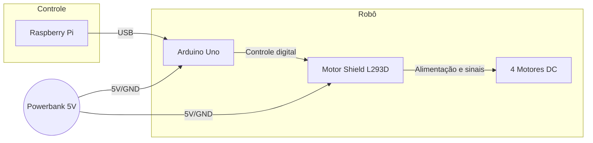
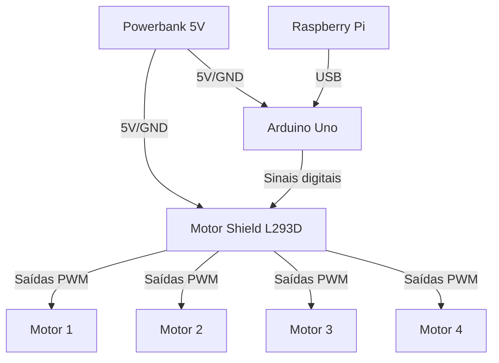

# Arduino

 Aqui estão contidos os códigos para o Arduino, que são utilizados para controlar os motores e receber comandos do Raspberry Pi.

## Estrutura do projeto

```
arduino/
├── VrumVrumVrum.ino
├── README.md
├── Adafruit_MotorShield.zip
```

## Como executar

Primeiro baixe a Arduino IDE [aqui](https://www.arduino.cc/en/software).

Com ela, abra o arquivo `VrumVrumVrum.ino` e faça o upload para a placa Arduino.
Não esqueça de instalar a biblioteca do Adafruit Motor Shield, que está contida no arquivo `Adafruit_MotorShield.zip`.

# Hardware e Montagem - Tralala VrumVrumVrum

Este módulo descreve a montagem eletrônica e física do robô, incluindo os componentes utilizados, ligações e o fluxo de comunicação entre as partes.

## Componentes Utilizados

- **Arduino Uno**
- **Motor Shield L293D (Driver Ponte H)**
- **4 Motores DC com caixa de redução**
- **4 Rodas**
- **Chassi para robô 4 rodas**
- **Powerbank 10000mAh 5V 1A** (alimentação do Arduino e motores)
- **Raspberry Pi** (recebe comandos do frontend e envia via USB para o Arduino)
- **Cabos jumper, parafusos, etc.**

## Diagrama de Blocos do Sistema



## Diagrama Elétrico Simplificado



## Fluxo de Comunicação

1. O usuário interage com o frontend (web) no Raspberry Pi.
2. O Raspberry Pi envia comandos via USB para o Arduino Uno.
3. O Arduino interpreta os comandos recebidos e aciona os motores através do Motor Shield L293D.
4. O Powerbank alimenta tanto o Arduino quanto o Motor Shield e os motores.

## Observações de Montagem

- O Motor Shield L293D deve ser encaixado sobre o Arduino Uno.
- Os motores DC são conectados nas saídas M1, M2, M3 e M4 do shield.
- O Powerbank pode ser conectado via cabo USB para alimentar o Arduino, que por sua vez alimenta o shield e os motores.
- O Raspberry Pi se conecta ao Arduino via cabo USB (porta serial).

## Dicas
- Certifique-se de que todas as conexões estejam firmes e corretas para evitar mau contato.
- O Powerbank deve fornecer corrente suficiente para todos os motores em funcionamento simultâneo.
- Fixe bem o chassi e os componentes para evitar vibrações excessivas.

---

Para detalhes do código, veja `Vehicle.ino`. Para integração com o sistema, consulte a documentação do backend e frontend.